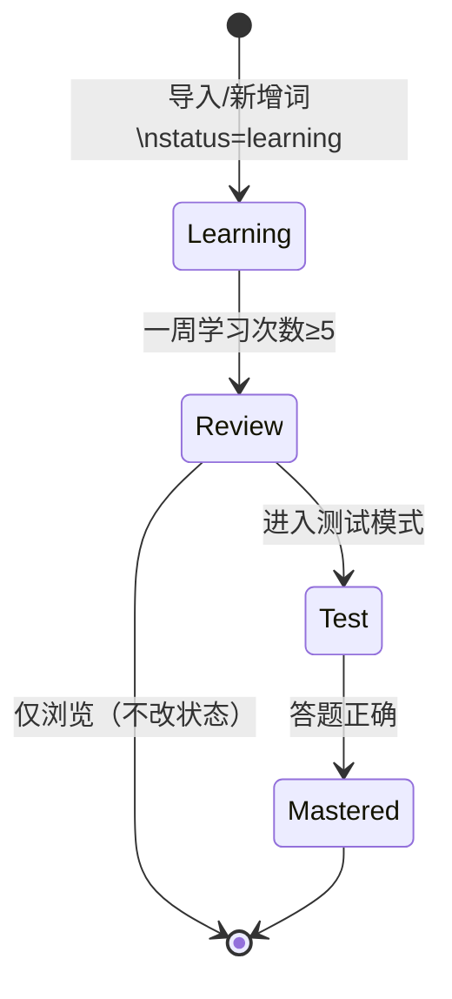

# 学习与词库逻辑参考

本文档汇总小程序中“学习/测试/复习”三种模式与词库（学习词汇表、复习词汇表、总词汇表、熟知词汇表）的设计与实现要点，供开发与调试参考。

## 数据模型（Word）

- id: number（唯一）
- word/meaning/sentence/translation/pronunciation
- category: 分类（已统一别名：GRE高频词、TOEFL高频词、IELTS高频词、AI专业词汇）
- status: 'learning' | 'review' | 'mastered'
- studyCount/correctCount/lastStudyTime
- weeklyStudyCount: 本周学习次数（驱动进入复习库）

说明：导入的新词默认 status='learning'，weeklyStudyCount=0。

## 词库视图定义（由 status 派生）

- 总词汇表：所有词（app.globalData.words）
- 学习词汇表：status === 'learning'
- 复习词汇表：status === 'review'
- 熟知词汇表：status === 'mastered'（仅用于统计/展示，不参与学习/测试）

## 三种模式与词库来源

- 学习模式（learning）
  - 当前实现：全量取词（总词汇表），进入模式时随机打乱，逐个显示
  - 显示：词、含义、翻译、来源信息
  - 学习事件：切换到下一词时累计一次学习（用于学习天数/数量统计）；同时递增当前词的 weeklyStudyCount，用于进入复习库

- 复习模式（review）
  - 来源：复习词汇表（status==='review'），进入模式时随机打乱
  - 显示：与学习模式类似
  - 学习事件：不改变词状态，仅用于复习浏览与统计展示

- 测试模式（test）
  - 来源：复习词汇表（status==='review'），进入模式时随机打乱
  - 显示：选项题（从全量词里抽错项）
  - 学习事件：答题记一次学习；答对则该词转入熟知库（status='mastered'）

## 状态流转规则

- 学习 → 复习：一周内学习次数达到阈值（当前阈值=5），词进入复习库（status='review'），并重置 weeklyStudyCount
- 复习 → 熟知：测试模式下答题正确，词进入熟知库（status='mastered'）
- 复习模式：仅复习查看，不触发状态变化

状态关系图：

## 顺序与轮换

- 进入任意模式时，对候选词数组做一次 Fisher-Yates 洗牌，按 currentIndex 从 0→N-1 依次展示
- 到末尾后：
  - 学习/复习/测试模式会检查是否仍存在符合条件的剩余词，若有则再次加载并重新打乱，形成自然轮换
  - 页面返回可触发 onShow → 再次 loadWords，从而重新随机顺序

## 空态与交互拦截

- 三种模式均有空态文案：
  - 学习：暂无需要学习的词汇（所有词都学完）
  - 复习：暂无需要复习的词汇（一周学习次数未达阈值）
  - 测试：暂无可测试的词汇（复习库为空）
- 空态时：隐藏词卡与导航按钮；所有“上一/下一个”等交互被拦截，避免空对象访问

## 统计与持久化

- 统计（日更）：
  - 学习模式：每切换到下一词计一次学习事件
  - 测试模式：每次答题计一次学习事件
  - 复习模式：不计入状态流转，但可扩展统计复习次数/正确率
- 持久化：
  - 全局词库保存在本地存储 `wx.setStorageSync('words')`
  - 启动时加载并做分类别名归一（详见“分类名归一化”）

## 分类名归一化（避免统计不一致）

为避免“GRE高频词汇”/“GRE高频词”等别名导致的计数分裂，启动与页面加载时做统一映射：

- GRE高频词汇 → GRE高频词
- TOEFL高频词汇 → TOEFL高频词
- IELTS高频词汇 → IELTS高频词
- AI领域常用及专有词汇 / AI领域内常用词和专有词 → AI专业词汇

## 可配置项与后续优化建议

- WEEKLY_REVIEW_THRESHOLD（每周进入复习阈值）：默认 5，可按需求调整
- 学习模式取词策略：当前为“全量取词”；可改为仅取 status==='learning'，以符合更传统的分层学习流
- 测试模式难度：错项来源、数量与重复策略可参数化
- 复习策略：可扩展为 SRS（间隔重复），基于正确率/遗忘曲线调整回访时间

## 关键实现位置（便于跳转）

- 学习页逻辑：`pages/study/study.js`
  - 加载与筛选：`loadWords()`（按模式取词并洗牌）
  - 学习/测试事件：`nextWord()`、`selectAnswer()`、`updateStudyRecord()`
  - 复习阈值判断：`checkLearningProgress(word)`（≥5 次进入复习）
  - 空态展现：`showEmptyState()`

- 词库管理：`pages/manage/manage.js`
  - 导入解析与分类识别：`parseVocabularyFile()` / `processVocabularyInfo()`
  - 列表与筛选：`loadWords()` / `filterWords()`
  - 同步本地存储：导入/删除后写入 `wx.setStorageSync('words')`

- 全局加载与分类归一：`app.js`
  - 启动加载：`loadVocabularyData()`
  - 分类名统一：`normalizeCategories(words)`（写回本地存储保证持久一致）

## 测试校验建议

- 用空库验证：三模式空态展示与交互拦截是否正确
- 用少量样本验证：学习 5 次后是否自动进入复习库；复习库在测试正确后是否进入熟知库
- 验证分类统计：首页分类计数与词汇页筛选结果是否一致（含 IELTS、AI专业）

## 备注

- 若后续切换学习模式取词策略为“仅学习词”，仅需在 `pages/study/study.js` 的 `case 'learning'` 中将来源改为 `words.filter(w => w.status==='learning')`，并保留洗牌逻辑即可。
